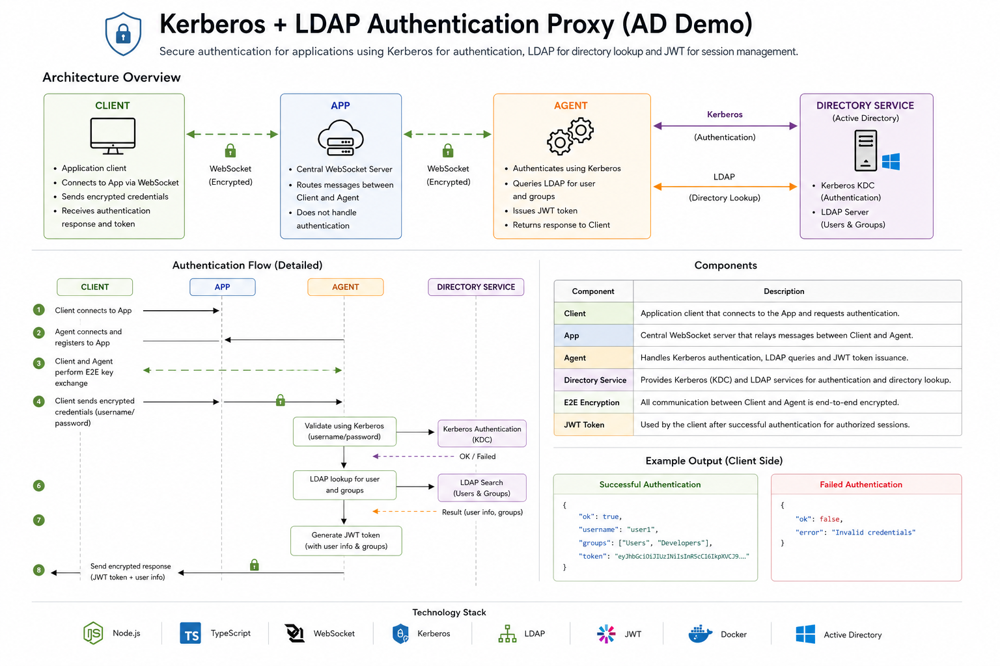

# 🔐 Kerberos + LDAP Authentication Proxy (AD Demo)

## 📌 Overview

This project demonstrates a **secure authentication architecture** for clients using:

* **Kerberos** → Authentication
* **LDAP** → User & group lookup
* **JWT** → Session management
* **WebSockets (TCMS)** → Communication layer
* **End-to-End Encryption (E2E)** → Secure client ↔ agent channel
* **Docker Compose** → Full environment orchestration

The system simulates a **real enterprise setup** where users authenticate against an **Active Directory (Samba AD)**.

---

## 🏗️ Architecture

```
Client  →  TCMS  →  Agent  →  Active Directory
                      │
              (Kerberos + LDAP)
```

---

## 🔄 Data Flow (Authentication Flow)

### 1. Connection & Registration

* Client connects to the **app (WebSocket)**
* Agent connects to the app and registers itself

---

### 2. Secure Channel Establishment

* Client ↔ Agent perform **E2E key exchange**
* A shared encryption key is derived
* All further communication is encrypted

---

### 3. Authentication Request

* Client sends encrypted credentials:

  ```
  username + password
  ```

---

### 4. Kerberos Authentication

* Agent validates credentials using **Kerberos**
* No password is sent over the network in plain text

---

### 5. LDAP Lookup

* If Kerberos succeeds:

  * Agent queries LDAP for:

    * User information
    * Group membership

---

### 6. Token Issuance

* Agent generates a **JWT token**
* Token includes:

  * username
  * groups
  * expiration

---

### 7. Response to Client

* Encrypted response is sent back:

  ```json
  {
    "ok": true,
    "token": "...",
    "username": "testuser",
    "groups": ["Users"]
  }
  ```

---

## 🧩 Components

### 🖥️ Client

* Simulates a client in an enterprise
* Establishes encrypted communication
* Sends authentication requests

---

### 🌐 App (Central Server)

* WebSocket relay between client and agent
* Routes messages securely
* Does NOT handle authentication logic

---

### ⚙️ Agent

* Core security component (designed as an on premise agent)
* Handles:

  * Kerberos authentication
  * LDAP queries
  * JWT generation
* Acts as bridge to Active Directory

---

### 🏢 Active Directory (Samba AD)

* Provides:

  * Kerberos (Authentication)
  * LDAP (Directory Service)
* Runs fully containerized

---

## 🖥️ Example Output

### Successful Authentication

```
[client] connected to application
[client] encrypted credentials sent to agent

[agent] received auth request for testuser
[agent] kerberos auth successful
[agent] ldap lookup successful

[client] auth response:
{
  ok: true,
  username: "testuser",
  groups: ["Users"],
  token: "eyJhbGciOiJIUzI1NiIs..."
}
```

---

### Failed Authentication

```
[agent] kerberos auth failed
[client] auth response:
{
  ok: false,
  error: "Invalid credentials"
}
```

---

## ⚙️ Setup & Run

### Requirements

* Docker
* Docker Compose

---

### Run the project

```bash
docker compose up --build
```

---

### Default Test User

```
Username: testuser
Password: Passw0rd!
```

(User is automatically created during container startup)

---

## 🔐 Security Features

* End-to-End encrypted communication
* Kerberos-based authentication (no plaintext passwords)
* LDAP directory validation
* Short-lived JWT tokens
* Isolated agent for AD communication

---

## 🎯 Key Design Decisions

| Component | Reason                             |
| --------- | ---------------------------------- |
| Kerberos  | Enterprise standard authentication |
| LDAP      | Directory queries (users + groups) |
| JWT       | Stateless session handling         |
| Agent     | Isolates AD from external access   |
| WebSocket | Real-time communication            |

---

## 🏗️ Architecture



## 🚀 Future Improvements

* Token refresh mechanism
* TLS (LDAPS / HTTPS)
* Health checks & service readiness
* UI frontend for login simulation

---

## 📖 Summary

This project demonstrates how to:

* Integrate **Kerberos + LDAP** in a real system
* Secure communication using **E2E encryption**
* Build a **distributed authentication architecture**
* Containerize a full identity infrastructure

---

## 👤 Author

Tom Avilés
